# PHASE 0 — Product & Architecture Specification
### Inventory + Warehouse Management System (Inventory Control Engine)

> **Status:** Architecture blueprint. **No production code is written in Phase 0.**
> Implementation may not begin until this document can correctly explain how stock moves
> `supplier → receiving → warehouse → reservation → release` and
> `warehouse → transfer → transit → destination warehouse` **without ever mutating a stock quantity directly.**
> See §22 (Invariant Proof) for that walkthrough.

---

## 0. Recommended Technology Stack (greenfield — repo was empty)

The repo has no existing code, so a stack must be chosen. The domain (multi-tenant SaaS, ACID
inventory posting, row-level concurrency, decimal money, RBAC, an eventual AI read layer) drives
the choice. Nothing below is load-bearing for the *domain* design — the entities, ledger, state
machines, and invariants in §3–§22 are stack-agnostic and portable.

| Layer | Recommendation | Why |
|---|---|---|
| Language | **TypeScript** end-to-end | One type model shared across API + UI; strong domain modelling |
| Monorepo | pnpm workspaces + Turborepo | `apps/api`, `apps/web`, `packages/domain`, `packages/contracts` |
| Backend | **NestJS** (modular, DI, guards, interceptors) | Modules map 1:1 to domains (§3); guards = RBAC; interceptors = audit/outbox |
| Database | **PostgreSQL 16** | ACID, `NUMERIC`, `SERIALIZABLE`/`SELECT … FOR UPDATE`, partial indexes, `jsonb` |
| ORM / migrations | **Prisma** (queries) + raw SQL for hot posting paths | Type-safe reads; explicit SQL where locking/atomicity matters |
| Frontend | **Next.js (App Router) + React** | Internal tool, SSR tables, fast routing |
| UI | Tailwind + shadcn/ui + **TanStack Table** | Data-dense grids, not oversized cards (§14 UX constraint) |
| Client data | TanStack Query | Cache, optimistic UI, retry with idempotency keys |
| Auth | Session/JWT + refresh; RBAC in guards | §11 permission matrix |
| Async / events | Transactional **Outbox** table → BullMQ/Redis workers (Phase 2+) | Reliable domain events (§16) without 2-phase commit |
| Money/qty | `NUMERIC(18,4)` in DB; `bigint` minor units or `decimal.js` in app | **Never floating point** (Constraint §7) |
| AI | Separate read-only service package `packages/ai` | AI reads via query services only — never writes ledger (§14) |
| Testing | Vitest/Jest (unit) · Testcontainers-Postgres (integration/concurrency) | Real DB for ledger + concurrency tests (§21) |

**Alternative if the team is PHP-first:** Laravel + PostgreSQL + Livewire/Inertia. The domain model
transfers unchanged; only §10's transport syntax changes.

---

## 1. Product Overview

**Problem.** SMEs run inventory across Excel, Sheets, paper stock cards, POS exports, Messenger, and
separate purchasing/accounting tools. The result: inaccurate quantities, duplicate SKUs, undocumented
releases, wrong transfers, stockouts *and* overstock at once, expired/damaged goods, no valuation, and
no way to answer "who released these 20 units and why?"

**Solution.** A single source of truth for inventory built on an **append-only movement ledger**. Every
quantity change is a *transaction* with a reason, a reference, an actor, and a timestamp. Stock balances
are **derived** from the ledger, never edited in place.

**Target businesses.** 5–250 employee SMEs; 1–20 warehouses/branches; hundreds to tens of thousands of
SKUs. Retail, distribution, manufacturing, construction, restaurants, computer shops, trading, and
service firms holding spare-parts/consumables.

**Primary users.** Warehouse staff (receive/pick/count on scanners), warehouse & inventory managers
(control, approvals, transfers), purchasing (reorder), finance/auditor (valuation, cost, audit),
management (exceptions & AI brief).

**Core value proposition.**
1. Accurate, real-time, *auditable* stock across every warehouse and location.
2. Exception-first operations — the system tells you what needs action (reorder, expiry, variance, stuck transfers).
3. An engine, not an app — stable services that CRM, POS, procurement, and accounting will plug into later.

**Inventory principles (non-negotiable).**
- Every quantity change has a **reason, reference, actor, timestamp**.
- Posted history is **immutable**; corrections are **reversals + replacements**.
- **Physical (on-hand)** ≠ **available** ≠ **incoming**. They are distinct quantities.
- Transfers maintain **stock-in-transit**; dispatch does not increase the destination.
- Reservations cannot exceed availability unless an authorized override records itself.
- Costing is **deterministic and server-side**.
- **AI recommends; deterministic rules decide.**

**Product boundaries (what Phase 0/MVP is NOT).** Not a full procurement suite, POS, CRM, GL/accounting,
or MRP. It *exposes stable boundaries* for those (§15, §44–46 of the brief) but does not implement them.
AI does not autonomously change stock.

---

## 2. User Roles

Roles are org-scoped. **Warehouse staff/managers may be further scoped to specific warehouses** (a user
sees/acts only within assigned warehouses). Cost/valuation visibility is a separate gate.

| Role | Access summary |
|---|---|
| **Super Admin** | Platform-level (cross-org, SaaS operator). Not a customer role. |
| **Administrator** | Full access within one organization: settings, users, roles, all inventory ops, cost & valuation. |
| **Inventory Manager** | All inventory operations across assigned warehouses; approve adjustments/counts; view cost & valuation; manage products/reorder rules. |
| **Warehouse Manager** | Operations within assigned warehouses: receive, put-away, pick, release, transfer, count; approve within limits; usually cost-visible, valuation optional. |
| **Warehouse Staff** | Execute receive/pick/put-away/count/scan within assigned warehouses. **No cost/valuation.** Cannot approve or post high-value adjustments. |
| **Purchasing** | Suppliers, reorder recommendations, incoming/PO view, supplier-product costs. Read inventory; cannot release/adjust. |
| **Finance** | Cost, valuation, costing method, all reports, export. Read-only on operations; may approve high-value adjustments (config). |
| **Approver** | Approve adjustments, transfers, releases, counts per approval policy. May be layered onto another role. |
| **Auditor** | Read-only everything incl. audit log, cost, valuation, movements. No mutations. |
| **Management / Viewer** | Dashboards, AI brief, reports. Read-only; valuation visibility configurable. |

Roles are a default bundle of **permissions** (§11). Custom roles = custom permission sets.

---

## 3. Domain Architecture

Modular domains (NestJS modules / `packages/domain` slices). Business logic lives in **domain services**,
never in controllers. Controllers are thin transport; posting happens through **command services** that
open a DB transaction and write the ledger + balance projection atomically.

```
                                   ┌─────────────┐
                                   │  PRODUCTS   │  (variants, categories, brands,
                                   │   MASTER    │   units, conversions)
                                   └──────┬──────┘
                                          │ describes
   ┌───────────┐   receives    ┌──────────▼──────────┐
   │ SUPPLIERS │──────────────▶│      RECEIVING      │
   └───────────┘               └──────────┬──────────┘
                                          │ posts +qty
                        ┌─────────────────▼─────────────────┐
                        │        STOCK MOVEMENT LEDGER       │  ◀── the single source of truth
                        │        (append-only, immutable)    │
                        └─────────────────┬─────────────────┘
        posts ±qty via ┌───────────┬──────┼──────┬───────────┬──────────────┐
                       ▼           ▼      ▼      ▼           ▼              ▼
                  RESERVATION   RELEASE TRANSFER ADJUSTMENT STOCK-COUNT   RETURNS
                       │           │      │      │           │              │
                       └───────────┴──────┼──────┴───────────┴──────────────┘
                                          ▼
                              ┌───────────────────────┐
                              │  STOCK BALANCE (proj.) │  on_hand / reserved / in_transit /
                              │  per org·wh·loc·sku·   │  quarantined / damaged  → available
                              │  batch·serial          │
                              └───────────┬───────────┘
                    ┌──────────┬──────────┼──────────┬──────────┐
                    ▼          ▼          ▼          ▼          ▼
                 REORDER   COSTING    ANALYTICS  NOTIFY     TRACEABILITY
                    │          │          │       (events)  (batch/serial)
                    └──────────┴────┬─────┴──────────┘
                                    ▼
                          ┌───────────────────┐
                          │  AI COPILOT (RO)  │ reads via query services only
                          └─────────┬─────────┘
                                    ▼
                          ┌───────────────────┐
                          │    INTEGRATIONS   │ adapter/event boundary →
                          │  CRM · POS · PROC │ CRM/POS/Procurement/Accounting/n8n
                          │  ACCT · SHIPPING  │
                          └───────────────────┘

Cross-cutting: AUTH · ORGANIZATIONS · USERS/ROLES/PERMISSIONS · AUDIT · SETTINGS · WAREHOUSES/LOCATIONS
```

**Dependency rules.**
- Everything organization-scoped depends on **Organizations**.
- All operational domains (Receiving/Release/Transfer/Adjustment/Count/Return/Reservation) depend on
  **Products**, **Warehouses/Locations**, and **write only through** the **StockMovements** ledger, which
  updates the **Inventory balance** projection.
- **Costing** subscribes to receipt/return/adjustment postings; **Reorder/Analytics/AI** are **read-only
  consumers** of balances + ledger.
- **Integrations** never touch inventory tables directly — they call command services / consume events.

---

## 4. Complete Entity Model

Conventions applied to (almost) every table:
- **PK:** `id` (UUID v7 preferred — sortable). **Org scope:** `organization_id` (FK, NOT NULL) on all
  tenant data. **Audit:** `created_at, updated_at, created_by, updated_by`; soft-delete via
  `deleted_at`/`status` where records may participate in postings (Constraint §11).
- Money & quantity: `NUMERIC(18,4)`. Never float.
- Every org-scoped unique constraint is **composite with `organization_id`**.

Below, per entity: **[PK]**, **Org?**, key fields, **FK→**, `IDX`, `UNIQUE`, status, audit notes.

### Identity & tenancy
- **organizations** — [id] · name, slug, currency, `settings jsonb`, plan, status. UNIQUE(slug). Root of tenancy.
- **users** — [id] · Org? per membership. email, password_hash, name, status, last_login_at. UNIQUE(email global) — or per-org via memberships. Audit: creation, login.
- **memberships** — [id] · Org? user_id→users, role_id→roles, `warehouse_scope uuid[]` (null = all). UNIQUE(org,user). Governs warehouse scoping.
- **roles** — [id] · Org? (system roles org-null) name, is_system. UNIQUE(org,name).
- **permissions** — [id] · code (e.g. `inventory.release`), description. UNIQUE(code). Static catalog.
- **role_permissions** — [role_id,permission_id]. Join.

### Product master
- **product_categories** — [id] · Org? name, parent_id→self (hierarchy), path/materialized_path, sort. IDX(parent_id). UNIQUE(org,parent_id,name). status active/inactive.
- **brands** — [id] · Org? name, manufacturer. UNIQUE(org,name).
- **units_of_measure** — [id] · Org? code (PCS/BOX/KG…), name, precision. UNIQUE(org,code).
- **unit_conversions** — [id] · Org? from_uom→uom, to_uom→uom, factor NUMERIC(18,6). UNIQUE(org,from,to). Guard: no rounding corruption — always convert to base stock unit with full precision, round only on display.
- **products** — [id] · Org? sku, barcode, name, description, product_type, category_id→categories, brand_id→brands, base_uom_id→uom, purchase_uom_id, sales_uom_id, cost NUMERIC, selling_price NUMERIC, tax_category, preferred_supplier_id→suppliers, min_stock, max_stock, reorder_point, reorder_qty, lead_time_days, `track_inventory bool`, `allow_negative bool`, `is_serialized bool`, `is_batch_tracked bool`, `is_expiry_tracked bool`, status, image_url, notes. **UNIQUE(org,sku)**, IDX(org,barcode), IDX(org,category_id), IDX(org,status). Audit: create/modify, **cost change is a sensitive audited event**.
- **product_variants** — [id] · Org? product_id→products, sku, barcode, attributes `jsonb` (e.g. `{size:S,color:Blue}`), cost, price, status. UNIQUE(org,sku). IDX(product_id). Optional — orgs may use none.
- **supplier_products** — [id] · Org? supplier_id→suppliers, product_id→products (or variant), supplier_sku, cost NUMERIC, lead_time_days, min_order_qty, is_preferred. UNIQUE(org,supplier_id,product_id). Many suppliers per SKU.

### Physical storage
- **warehouses** — [id] · Org? code, name, type (enum), address, manager_id→users, phone, email, status, is_default, allow_receiving, allow_dispatch, notes. UNIQUE(org,code).
- **warehouse_locations** — [id] · Org? warehouse_id→warehouses, code (e.g. `WH-A-04-03-B-02`), parent_id→self (zone/aisle/rack/shelf/bin hierarchy), type, is_pickable, is_receiving_area, status. UNIQUE(org,warehouse_id,code). IDX(parent_id). Detailed bins can be disabled per warehouse (default location fallback).

### Inventory ledger + balance
- **inventory_movements** — [id] · Org? txn_number, movement_type (enum), product_id→products, variant_id, quantity NUMERIC (**always positive**; direction encoded by type + slot), uom_id, `state_bucket` (on_hand/reserved/in_transit/quarantined/damaged), source_warehouse_id, source_location_id, dest_warehouse_id, dest_location_id, reference_type, reference_id, unit_cost NUMERIC, total_cost NUMERIC, batch_id→batches, serial_id→serial_numbers, performed_by→users, approved_by→users, reason, `reversal_of_id`→self, `idempotency_key`, posted_at. **APPEND-ONLY — no UPDATE/DELETE after post.** UNIQUE(org,idempotency_key). IDX(org,product_id,posted_at), IDX(org,reference_type,reference_id), IDX(org,source_warehouse_id), IDX(batch_id), IDX(serial_id). This is the authoritative record.
- **inventory_balances** — [id] · Org? product_id, variant_id, warehouse_id, location_id, batch_id, serial_id, `on_hand`, `reserved`, `in_transit`, `quarantined`, `damaged`, `incoming` NUMERIC, `avg_cost` NUMERIC, `version int` (optimistic lock), updated_at. **UNIQUE(org,product,variant,warehouse,location,batch,serial)**. IDX(org,product), IDX(org,warehouse). Materialized projection of the ledger (see §7). `available = on_hand − reserved − quarantined` (damaged & in_transit tracked separately).

### Operational documents (each = header + items, each has a state machine §8)
- **goods_receipts** — [id] · Org? receipt_number, supplier_id, purchase_order_ref, warehouse_id, receiving_date, received_by, delivery_receipt_ref, supplier_invoice_ref, status (enum), notes. UNIQUE(org,receipt_number).
- **goods_receipt_items** — [id] · receipt_id→goods_receipts, product_id, variant_id, expected_qty, received_qty, rejected_qty, unit_cost, batch fields, expiry_date, serials, put_away_location_id, remarks.
- **stock_reservations** — [id] · Org? reservation_number, product_id, warehouse_id, qty, reference_type, reference_id, status (active/released/cancelled/expired), expires_at, created_by. IDX(org,product,warehouse,status).
- **stock_releases** / **stock_release_items** — [id] · release_number, requestor_id, purpose, warehouse_id, destination_type, destination_ref, reference, status; items: product, requested_qty, approved_qty, released_qty, location_id, batch/serial. UNIQUE(org,release_number).
- **stock_transfers** / **stock_transfer_items** — [id] · transfer_number, source_warehouse_id, dest_warehouse_id, status (incl. `IN_TRANSIT`), dispatched_by, received_by, dispatch_date, receive_date; items: product, qty, qty_dispatched, qty_received, batch/serial. UNIQUE(org,transfer_number).
- **stock_adjustments** / **stock_adjustment_items** — [id] · adjustment_number, warehouse_id, reason_id→adjustment_reasons, status (draft→submitted→approved→posted), evidence attachments, requested_by, approved_by; items: product, location, direction(in/out), qty, unit_cost, batch/serial. UNIQUE(org,adjustment_number).
- **stock_counts** / **stock_count_items** — [id] · count_number, type (full/cycle/warehouse/category/bin/random), warehouse_id, is_blind, snapshot_at, status; items: product, location, batch/serial, `system_qty` (snapshot), `counted_qty`, `recount_qty`, variance, resolved. UNIQUE(org,count_number).
- **returns** / **return_items** — [id] · return_number, return_type (customer/supplier/internal), reference, warehouse_id, status; items: product, qty, disposition (restock/damaged/repair/quarantine/return_to_supplier/dispose), batch/serial. UNIQUE(org,return_number).
- **adjustment_reasons** — [id] · Org? code, name, requires_approval, requires_evidence. UNIQUE(org,code). Config table.

### Traceability & costing
- **batches** — [id] · Org? product_id, batch_number, mfg_date, expiry_date, received_date, supplier_id, warehouse_id, location_id. UNIQUE(org,product_id,batch_number). IDX(org,expiry_date) for FEFO/expiry reports.
- **serial_numbers** — [id] · Org? product_id, serial, status (in_stock/reserved/released/returned/scrapped), current_warehouse_id, current_location_id, batch_id, supplier_id, received_at, released_at, customer_ref. **UNIQUE(org,product_id,serial)**. Invariant: a serial in `in_stock`/`reserved` exists in exactly one location (§20).
- **cost_layers** — [id] · Org? product_id, warehouse_id, source_movement_id, qty_remaining, unit_cost, received_at. Supports future **FIFO**; in WAC MVP kept optional/for audit. IDX(org,product,warehouse,received_at).

### Reorder, ops, cross-cutting
- **reorder_rules** — [id] · Org? product_id, warehouse_id, min_stock, reorder_point, reorder_qty, safety_stock, avg_daily_usage (computed), preferred_supplier_id, is_active. UNIQUE(org,product,warehouse).
- **reorder_recommendations** — [id] · Org? product_id, warehouse_id, available, incoming, reorder_point, suggested_qty, supplier_id, est_cost, generated_at, status (open/actioned/dismissed). Regenerated, not hand-edited.
- **notifications** — [id] · Org? user_id/role, type, severity, title, body, entity_type, entity_id, channel, read_at, created_at. IDX(org,user_id,read_at).
- **attachments** — [id] · Org? entity_type, entity_id, filename, url, mime, size, uploaded_by. Secure upload (Constraint §12).
- **audit_logs** — [id] · Org? user_id, action, entity_type, entity_id, old_value `jsonb`, new_value `jsonb`, reference, ip_address, created_at. **Append-only.** IDX(org,entity_type,entity_id), IDX(org,created_at).
- **integration_events** (a.k.a. outbox) — [id] · Org? event_type, payload `jsonb`, `idempotency_key`, status (pending/processing/done/failed), attempts, available_at, created_at. Drives §16 domain events reliably.
- **ai_insights** — [id] · Org? type (reorder/anomaly/forecast/brief), scope, payload `jsonb`, confidence NUMERIC, generated_at, status. Read-derived; never a source of quantities.

---

## 5. ERD (Mermaid)

Grouped: **Product Master · Physical Storage · Inventory Ledger · Operational Documents · Costing · Traceability.**

```mermaid
erDiagram
    ORGANIZATIONS ||--o{ USERS_MEMBERSHIP : has
    ORGANIZATIONS ||--o{ PRODUCTS : owns
    ORGANIZATIONS ||--o{ WAREHOUSES : owns

    %% ---------- PRODUCT MASTER ----------
    PRODUCT_CATEGORIES ||--o{ PRODUCT_CATEGORIES : parent
    PRODUCT_CATEGORIES ||--o{ PRODUCTS : classifies
    BRANDS ||--o{ PRODUCTS : brands
    UNITS_OF_MEASURE ||--o{ PRODUCTS : base_uom
    UNITS_OF_MEASURE ||--o{ UNIT_CONVERSIONS : from_to
    PRODUCTS ||--o{ PRODUCT_VARIANTS : variant_of
    PRODUCTS ||--o{ SUPPLIER_PRODUCTS : supplied_as
    SUPPLIERS ||--o{ SUPPLIER_PRODUCTS : supplies

    %% ---------- PHYSICAL STORAGE ----------
    WAREHOUSES ||--o{ WAREHOUSE_LOCATIONS : contains
    WAREHOUSE_LOCATIONS ||--o{ WAREHOUSE_LOCATIONS : parent

    %% ---------- INVENTORY LEDGER (authoritative) ----------
    PRODUCTS ||--o{ INVENTORY_MOVEMENTS : moves
    WAREHOUSES ||--o{ INVENTORY_MOVEMENTS : source_dest
    INVENTORY_MOVEMENTS ||--o| INVENTORY_MOVEMENTS : reverses
    PRODUCTS ||--o{ INVENTORY_BALANCES : balance_of
    WAREHOUSES ||--o{ INVENTORY_BALANCES : at
    WAREHOUSE_LOCATIONS ||--o{ INVENTORY_BALANCES : at_location

    %% ---------- OPERATIONAL DOCUMENTS ----------
    SUPPLIERS ||--o{ GOODS_RECEIPTS : from
    WAREHOUSES ||--o{ GOODS_RECEIPTS : into
    GOODS_RECEIPTS ||--o{ GOODS_RECEIPT_ITEMS : lines
    PRODUCTS ||--o{ GOODS_RECEIPT_ITEMS : of

    WAREHOUSES ||--o{ STOCK_RELEASES : from
    STOCK_RELEASES ||--o{ STOCK_RELEASE_ITEMS : lines

    WAREHOUSES ||--o{ STOCK_TRANSFERS : source
    STOCK_TRANSFERS ||--o{ STOCK_TRANSFER_ITEMS : lines

    WAREHOUSES ||--o{ STOCK_ADJUSTMENTS : at
    ADJUSTMENT_REASONS ||--o{ STOCK_ADJUSTMENTS : reason
    STOCK_ADJUSTMENTS ||--o{ STOCK_ADJUSTMENT_ITEMS : lines

    WAREHOUSES ||--o{ STOCK_COUNTS : at
    STOCK_COUNTS ||--o{ STOCK_COUNT_ITEMS : lines

    WAREHOUSES ||--o{ RETURNS : at
    RETURNS ||--o{ RETURN_ITEMS : lines

    PRODUCTS ||--o{ STOCK_RESERVATIONS : reserves

    %% ---------- TRACEABILITY ----------
    PRODUCTS ||--o{ BATCHES : lot_of
    PRODUCTS ||--o{ SERIAL_NUMBERS : unit_of
    BATCHES ||--o{ INVENTORY_MOVEMENTS : traced
    SERIAL_NUMBERS ||--o{ INVENTORY_MOVEMENTS : traced

    %% ---------- COSTING ----------
    PRODUCTS ||--o{ COST_LAYERS : layered
    INVENTORY_MOVEMENTS ||--o{ COST_LAYERS : creates

    %% ---------- REORDER / AI / AUDIT ----------
    PRODUCTS ||--o{ REORDER_RULES : rule
    PRODUCTS ||--o{ REORDER_RECOMMENDATIONS : suggests
    ORGANIZATIONS ||--o{ AUDIT_LOGS : records
    ORGANIZATIONS ||--o{ INTEGRATION_EVENTS : emits
    ORGANIZATIONS ||--o{ AI_INSIGHTS : derives
```



---

## 6. Inventory Ledger Design

The ledger is a **quantity double-entry** system. Each `inventory_movements` row is **positive** and
carries a **movement_type** plus source/destination *slots* and a **state_bucket**. The type determines
which balance bucket(s) change and in which direction. A single business action may post **several** rows
(e.g. a transfer posts an OUT and a companion IN-TRANSIT).

**Direction table (how each type mutates balances):**

| movement_type | Source effect | Destination effect | Buckets touched |
|---|---|---|---|
| `OPENING_BALANCE` | — | +qty | `on_hand` at dest |
| `PURCHASE_RECEIPT` | — | +qty | `on_hand` at receiving wh/loc; feeds costing |
| `SALES_RELEASE` / `PROJECT_ISSUE` / `INTERNAL_CONSUMPTION` / `PRODUCTION_CONSUMPTION` | −qty | — | `on_hand` at source |
| `TRANSFER_OUT` | −qty on_hand | +qty in_transit | source `on_hand↓`, `in_transit↑` |
| `TRANSFER_IN` | −qty in_transit | +qty on_hand | dest `in_transit↓`, `on_hand↑` |
| `CUSTOMER_RETURN` | — | +qty (to `quarantined` or `on_hand` per disposition) | dest bucket per disposition |
| `SUPPLIER_RETURN` | −qty | — | `on_hand` at source |
| `STOCK_ADJUSTMENT_IN` | — | +qty | `on_hand` (approved variance/found) |
| `STOCK_ADJUSTMENT_OUT` | −qty | — | `on_hand` (shrinkage/loss) |
| `DAMAGE` | −qty on_hand | +qty damaged | `on_hand↓`, `damaged↑` |
| `EXPIRY` | −qty on_hand | +qty damaged/expired | `on_hand↓`, `damaged↑` |
| `PRODUCTION_OUTPUT` | — | +qty | `on_hand` at output wh |
| `RESERVE` (logical) | reserved↑ | — | `reserved↑` (no on_hand change) |
| `UNRESERVE` (logical) | reserved↓ | — | `reserved↓` |

**Reservations** are modelled as movements into/out of the `reserved` bucket (or as
`stock_reservations` rows aggregated into `inventory_balances.reserved`). They **do not** change
`on_hand`; they change **available** by definition (`available = on_hand − reserved − quarantined`).

**Mapping each business flow to ledger postings:**
- **Receiving (post):** for each accepted line → `PURCHASE_RECEIPT +qty` into receiving location; create/append `cost_layers`; recompute `avg_cost` (§12). Rejected qty posts nothing (or `quarantined` if held).
- **Release (post):** validate `available ≥ qty`; consume matching reservation if any (`reserved↓`); `SALES_RELEASE −qty` from source.
- **Transfer (dispatch):** `TRANSFER_OUT` (source `on_hand↓`, `in_transit↑`). **(receive):** `TRANSFER_IN` (dest `on_hand↑`, `in_transit↓`). Cost travels with the goods (moving-average carried on the layer).
- **Return (post + disposition):** `CUSTOMER_RETURN +qty` into `quarantined`; a follow-up disposition posts `STOCK_ADJUSTMENT_IN`→on_hand (restock) or `DAMAGE`/`dispose` etc. Never straight to sellable without validation.
- **Adjustment (post):** `STOCK_ADJUSTMENT_IN/OUT` with reason + approver; high value → extra approval.
- **Count variance (post):** approved variance becomes `STOCK_ADJUSTMENT_IN/OUT` referencing the count.

**Immutability & corrections.** After `posted_at` a movement is never updated or deleted. To correct:
post a **reversal** (`reversal_of_id` set; opposite direction, same magnitude) then a **replacement**.
Example: wrong receipt `+100` → reverse `−100` → correct `+80` → net `+80`, full history preserved.

---

## 7. Stock Balance Design

**Decision: materialized projection with the ledger as source of truth** (not pure on-the-fly `SUM`).

- **Why not pure dynamic sum:** balances are read on nearly every screen and every reservation/release
  check; summing the whole ledger per read does not scale to tens of thousands of SKUs × many warehouses,
  and concurrency control on availability needs a single lockable row.
- **Why not balance-only (no ledger):** loses auditability and violates the core principle.

**Design.** `inventory_balances` holds one row per `(org, product, variant, warehouse, location, batch,
serial)` with buckets `on_hand, reserved, in_transit, quarantined, damaged, incoming` and `avg_cost`,
plus a `version` for optimistic locking. It is updated **inside the same DB transaction** that appends
the movement(s) — never independently. `available` is computed (`on_hand − reserved − quarantined`), not
stored, or stored as a generated column.

**Consistency strategy.**
1. All posting is wrapped in a **serializable/repeatable-read transaction**; the balance row is locked
   with `SELECT … FOR UPDATE` (or optimistic `version` check) before mutation → prevents the race in §21.
2. Ledger insert + balance update + cost-layer update + outbox event are **one atomic transaction**
   (all-or-nothing, Constraint §4).
3. **Reconciliation job** (nightly + on-demand) recomputes balances from the ledger and asserts equality;
   any drift raises an alert. This makes the ledger authoritative and the projection verifiable — the
   basis of the "reconciliation test" in §21.
4. `incoming` is derived from open receipts/POs and **kept separate** from `on_hand` — never mixed
   (Constraint from brief §8).

---

## 8. Inventory State Machines

Forbidden transitions: any jump that skips approval/posting, any edit of a `POSTED`/`RECEIVED`/`COMPLETED`
document, and any backward move out of a terminal state. Corrections use reversals, not status rollbacks.

**Goods Receipt**
```
DRAFT → RECEIVING → FOR_INSPECTION → COMPLETED
   │         │              │
   │         └──────────────┴─→ PARTIALLY_RECEIVED → COMPLETED
   └─→ CANCELLED            └─→ REJECTED
Forbidden: COMPLETED→any; posting occurs on entering COMPLETED/PARTIALLY_RECEIVED.
```

**Stock Transfer** (maintains in-transit)
```
DRAFT → FOR_APPROVAL → APPROVED → PICKING → DISPATCHED → IN_TRANSIT → PARTIALLY_RECEIVED → RECEIVED
   └───────────────→ CANCELLED (only before DISPATCHED)
Ledger: TRANSFER_OUT on DISPATCHED; TRANSFER_IN on RECEIVED. Dest on_hand rises ONLY at RECEIVED.
Forbidden: DISPATCHED→CANCELLED (goods already left — use a return/adjustment); RECEIVED→any.
```

**Stock Release**
```
DRAFT → FOR_APPROVAL → APPROVED → PICKING → VERIFIED → RELEASED
   └───→ CANCELLED (before RELEASED)
Ledger: SALES_RELEASE on RELEASED. Availability checked at APPROVED and re-checked at RELEASED.
Forbidden: RELEASED→edit/cancel (use return).
```

**Stock Adjustment**
```
DRAFT → SUBMITTED → APPROVED → POSTED
   │        │           └─(high value)→ SECOND_APPROVAL → POSTED
   └────────┴──→ REJECTED / CANCELLED (before POSTED)
Ledger: ADJUSTMENT_IN/OUT on POSTED. Forbidden: POSTED→any.
```

**Stock Count**
```
DRAFT → SNAPSHOT_TAKEN → COUNTING → (RECOUNT) → VARIANCE_REVIEW → APPROVED → ADJUSTED → CLOSED
   └─→ CANCELLED (before ADJUSTED)
system_qty frozen at SNAPSHOT_TAKEN; variance→adjustment on ADJUSTED. Forbidden: CLOSED→any.
```

**Return**
```
DRAFT → RECEIVED → INSPECTION → DISPOSITION_SET → POSTED → CLOSED
   └─→ CANCELLED (before POSTED)
Disposition determines follow-on ledger postings. Forbidden: POSTED→edit.
```

**Reservation**
```
ACTIVE → (RELEASED | CANCELLED | EXPIRED)
available recomputes on every transition. Forbidden: RELEASED/CANCELLED→ACTIVE.
```

---

## 9. Screen Inventory

```
/login  /forgot-password
/dashboard

# Inventory
/products                      /products/new                 /products/:id   /products/:id/edit
/products/:id/variants
/inventory                     (stock overview grid: on_hand/reserved/available/in_transit by wh/loc)
/inventory/stock-card/:productId
/inventory/movements           (ledger explorer, filterable)
/inventory/reservations        /inventory/reservations/:id
/inventory/reorder             (alerts + recommendations)

# Warehouse
/warehouses                    /warehouses/:id               /warehouses/:id/locations
/receiving                     /receiving/new                /receiving/:id   /receiving/:id/inspect
/put-away                      /put-away/:receiptId
/picking                       /picking/:id
/releases                      /releases/new                 /releases/:id
/transfers                     /transfers/new                /transfers/:id   /transfers/:id/receive

# Control
/adjustments                   /adjustments/new              /adjustments/:id
/counts                        /counts/new                   /counts/:id      /counts/:id/count
/counts/cycle
/returns                       /returns/new                  /returns/:id
/damaged
/expiring

# Supply
/suppliers                     /suppliers/:id
/reorder-recommendations

# Analytics
/reports                       /reports/inventory            /reports/valuation
/reports/aging                 /reports/movement             /reports/fast-slow
/analytics/valuation           /analytics/aging

# Automation
/ai/insights                   /ai/copilot                   /workflows        /integrations

# Administration
/admin/users                   /admin/roles                  /admin/units
/admin/categories              /admin/brands                 /admin/adjustment-reasons
/admin/settings                /admin/audit-log              /admin/import-export

# Global
/search  (SKU/barcode/serial/batch/ref; scanner-aware)
```

Navigation groups mirror the brief: Dashboard · Inventory · Warehouse · Control · Supply · Analytics ·
Automation · Administration. UX is **data-dense grids**, keyboard/scanner-first, not oversized cards.

---

## 10. API Architecture

Two clearly separated endpoint families:

**CRUD endpoints** (masters, drafts): `GET/POST/PATCH/DELETE` on `/products`, `/suppliers`, `/warehouses`,
`/warehouse-locations`, `/categories`, `/units`, `/reorder-rules`, draft documents, etc. `PATCH` mutates
*documents in draft*, **never** posted inventory.

**Business command endpoints** (posting — the only way stock moves). Verbs, idempotent, transactional:

```
# Receiving
POST /inventory/receipts                         (create draft)
POST /inventory/receipts/{id}/inspect
POST /inventory/receipts/{id}/post               → ledger PURCHASE_RECEIPT (Idempotency-Key required)

# Reservations
POST /inventory/reservations                     → atomic reserve (rejects if available<qty unless override)
POST /inventory/reservations/{id}/release
POST /inventory/reservations/{id}/cancel

# Releases
POST /inventory/releases                         (draft)
POST /inventory/releases/{id}/approve
POST /inventory/releases/{id}/pick
POST /inventory/releases/{id}/post               → ledger SALES_RELEASE

# Transfers
POST /inventory/transfers                         (draft)
POST /inventory/transfers/{id}/approve
POST /inventory/transfers/{id}/dispatch          → ledger TRANSFER_OUT (source on_hand↓, in_transit↑)
POST /inventory/transfers/{id}/receive           → ledger TRANSFER_IN  (dest on_hand↑, in_transit↓)

# Adjustments
POST /inventory/adjustments                       (draft)
POST /inventory/adjustments/{id}/submit
POST /inventory/adjustments/{id}/approve
POST /inventory/adjustments/{id}/post            → ledger ADJUSTMENT_IN/OUT

# Counts
POST /inventory/counts                            (create + snapshot)
POST /inventory/counts/{id}/submit-counts
POST /inventory/counts/{id}/approve
POST /inventory/counts/{id}/post-variance        → ledger ADJUSTMENT_IN/OUT

# Returns
POST /inventory/returns                           (draft)
POST /inventory/returns/{id}/inspect
POST /inventory/returns/{id}/post                → disposition-driven ledger

# Queries (read models)
GET  /inventory/balances?warehouse=&product=&state=
GET  /inventory/movements?product=&type=&from=&to=
GET  /inventory/products/{id}/stock-card
GET  /inventory/valuation?by=warehouse|category|brand
GET  /inventory/reorder-recommendations
```

**Rules.** Every posting command: (1) requires `Idempotency-Key` header → `idempotency_key` (Constraint
§6); (2) runs in one DB transaction; (3) is guarded by an RBAC permission (§11); (4) writes an audit log
and an outbox event. **Posting is never a generic `PATCH`/`PUT` on a balance.**

---

## 11. Permission Matrix

Permission codes (catalog): `inventory.view`, `inventory.receive`, `inventory.release`,
`inventory.transfer`, `inventory.count`, `inventory.adjust`, `inventory.approve_adjustment`,
`inventory.reserve`, `cost.view`, `valuation.view`, `report.export`, `product.manage`,
`warehouse.manage`, `user.manage`, `override.negative`.

| Capability | Admin | Inv Mgr | Wh Mgr | Wh Staff | Purchasing | Finance | Approver | Auditor |
|---|:--:|:--:|:--:|:--:|:--:|:--:|:--:|:--:|
| View Inventory | ✅ | ✅ | ✅ (scoped) | ✅ (scoped) | ✅ | ✅ | ✅ | ✅ |
| Receive | ✅ | ✅ | ✅ | ✅ | ➖ | ➖ | ➖ | ➖ |
| Release | ✅ | ✅ | ✅ | ✅* | ➖ | ➖ | ➖ | ➖ |
| Transfer | ✅ | ✅ | ✅ | ✅* | ➖ | ➖ | ➖ | ➖ |
| Count | ✅ | ✅ | ✅ | ✅ | ➖ | ➖ | ➖ | ➖ |
| Adjust (submit) | ✅ | ✅ | ✅ | ➖ | ➖ | ➖ | ➖ | ➖ |
| Approve Adjustment | ✅ | ✅ | ✅** | ➖ | ➖ | ✅** | ✅ | ➖ |
| Reserve | ✅ | ✅ | ✅ | ➖ | ➖ | ➖ | ➖ | ➖ |
| View Cost | ✅ | ✅ | ⚙️ | ➖ | ✅ | ✅ | ➖ | ✅ |
| View Valuation | ✅ | ✅ | ⚙️ | ➖ | ➖ | ✅ | ➖ | ✅ |
| Export | ✅ | ✅ | ✅ | ➖ | ✅ | ✅ | ➖ | ✅ |
| Manage Products | ✅ | ✅ | ➖ | ➖ | ⚙️ | ➖ | ➖ | ➖ |
| Manage Warehouse | ✅ | ✅ | ✅ (own) | ➖ | ➖ | ➖ | ➖ | ➖ |
| Override Negative | ✅ | ⚙️ | ➖ | ➖ | ➖ | ➖ | ➖ | ➖ |

✅ granted · ➖ denied · ⚙️ configurable · ✅* only within assigned warehouse & requires approval to post ·
✅** only up to a configured value threshold (high-value → Approver/Finance). Warehouse scoping applies to
every ✅ in the operational rows.

---

## 12. Costing Model (MVP = Weighted Average Cost)

**MVP: Moving Weighted Average Cost (WAC), computed server-side, per `(product, warehouse)`** (or org-wide
per product if warehouse-level costing is disabled in settings).

`new_avg = (on_hand·old_avg + received_qty·received_unit_cost) / (on_hand + received_qty)`

Effect of each operation on cost:
- **Receiving:** recompute `avg_cost` with the formula above; append a `cost_layer` (qty, unit_cost).
- **Release / consumption / damage / expiry / adjustment-out:** valued at **current `avg_cost`**;
  `avg_cost` unchanged (only qty falls).
- **Transfer:** OUT at source `avg_cost`; the moving cost **travels** to the destination and blends into
  the destination's WAC on receive (destination `new_avg` weighted by incoming qty×carried cost).
- **Return (restock):** re-enters at the original release cost (or current WAC per policy) — configurable.
- **Adjustment-in (found):** at current `avg_cost` unless a cost is specified (e.g. opening balance).

**Worked example:** 100 @ ₱100 then 50 @ ₱120 → total ₱16,000 / 150 = **₱106.6667** avg.

**FIFO-ready:** `cost_layers` already records dated layers with `qty_remaining`. Switching to FIFO means
consuming oldest layers first at layer cost instead of applying WAC — no schema change, a strategy swap
behind a `CostingStrategy` interface. Specific-Identification piggybacks on serial/batch layers.

All money is `NUMERIC(18,4)`; rounding only at display. Cost visibility gated by `cost.view` (§11).

---

## 13. Barcode / QR Architecture

Scanning is **input-agnostic**. A scanner (USB HID) types characters + Enter into the focused field; a
phone camera decodes to the same string. The app treats both as a **scan event → resolver**:

```
scan string ──▶ ScanResolver ──▶ classify (SKU | barcode | serial | batch | location code | doc ref)
                                   └─▶ context action (receiving/picking/count/transfer/lookup)
```

- **Barcode types supported:** product barcode, internal barcode, QR, warehouse-location barcode, bin
  barcode, transfer barcode, receipt/document barcode.
- **Workflows:** receiving (scan item → qty), picking (scan location → scan item → confirm), counting
  (scan bin → scan items), transfers, returns, product lookup.
- **No vendor lock-in:** core logic depends only on the decoded string + a resolver interface. USB HID
  needs no driver; camera decoding uses a swappable library on the client. Location/bin codes are just
  `warehouse_locations.code`. QR payloads are structured (`type:id`) so one scan opens the right entity.
- Global `/search` accepts scanner input and routes directly to the matching product/transaction.

---

## 14. AI Architecture

**Hard separation** between the deterministic engine and the AI layer:

```
┌─────────────────────────────┐        read-only         ┌───────────────────────────┐
│ DETERMINISTIC INVENTORY CORE │  ◀── query services ──── │   AI RECOMMENDATION LAYER │
│ ledger · balances · costing  │                          │ copilot · reorder · fcst  │
│ (SOURCE OF TRUTH)            │  ──── proposals only ──▶ │ anomaly · exec brief      │
└─────────────────────────────┘   (never writes ledger)  └───────────────────────────┘
```

- AI reads through the **same query services** the UI uses (balances, movements, stock-card, valuation) —
  never raw tables, always org-scoped, always cost-permission-aware.
- AI **may**: analyze, recommend reorders, forecast demand (with **confidence shown**), explain valuation
  changes, detect anomalies, draft replenishment suggestions → stored as `ai_insights` / surfaced in copilot.
- AI **must not**: change quantities, post adjustments/transfers/releases, approve anything, delete
  transactions, create liabilities, or approve purchases. Any action AI proposes must pass through the
  **same deterministic command endpoint + RBAC + approval** a human would use.
- AI is **never the source of truth for quantities** (Constraint §13).

---

## 15. Integration Architecture

Adapter + event boundary. External systems integrate through **command services** and **domain events
(outbox)** — never by writing inventory tables.

```
CRM / Sales ─┐
POS ─────────┤   adapters   ┌─ inbound commands ─▶  reservation / release command services
E-commerce ──┼─────────────▶│
Procurement ─┤              └─ outbound events ──▶  StockReceived / StockBelowReorderPoint / …
Accounting ──┤   (integration_events outbox → n8n / webhooks / queue consumers)
Shipping ────┘
```

- **Inbound** (POS sale, sales order): call `POST /inventory/reservations` then `/releases/{id}/post`.
  POS **never** decrements a table directly (brief §46).
- **Outbound**: emit domain events (§16) via the outbox; consumers (n8n, procurement, accounting, notifier)
  subscribe. Idempotency keys prevent double-application on retries.
- Domains stay **loosely coupled**: procurement/CRM/accounting are separate bounded contexts that speak to
  inventory only through stable contracts (`packages/contracts`).

---

## 16. Domain Events

Emitted transactionally via the outbox; consumed by notifications, n8n workflows, procurement, AI, accounting.

```
ProductCreated · ProductCostChanged
StockReceived · StockReserved · StockReleased
StockTransferDispatched · StockTransferReceived
StockAdjusted · StockCountCompleted
StockBelowReorderPoint · StockOutDetected · OverstockDetected
BatchExpiring · SerialStatusChanged
NegativeInventoryAttempted · InventoryAnomalyDetected
GoodsReceiptPosted · ReturnPosted
```

Each event: `{ id, organization_id, type, occurred_at, actor, entity_type, entity_id, payload, idempotency_key }`.

---

## 17. Report Specification

| Report | Purpose | Key filters | Columns / formula | Source |
|---|---|---|---|---|
| Current Inventory | On-hand snapshot | wh, loc, category, brand | on_hand, reserved, available, value | balances |
| Inventory Valuation | Value of stock | wh, category, brand, date | `Σ(on_hand × avg_cost)` | balances + cost |
| Stock Card | Per-SKU ledger | product, wh, date, type, user, ref | date, ref, in, out, running balance | movements |
| Inventory Movement | All movements | product, type, wh, user, date | txn, type, qty, cost, ref, actor | movements |
| Warehouse Inventory | Stock by wh | wh | product, on_hand, available, value | balances |
| Low Stock | Below reorder | wh, category | available ≤ reorder_point | balances + rules |
| Out of Stock | Zero available | wh | available ≤ 0 | balances |
| Overstock | Above max | wh | on_hand > max_stock | balances + rules |
| Inventory Aging | Age buckets | wh, category | 0-30/31-60/61-90/91-180/181-365/365+ by receipt date | movements/layers |
| Slow/Dead Moving | Velocity | period, wh | movements in window vs on_hand | movements |
| Receiving | GR activity | supplier, wh, date | receipts, expected vs received vs rejected | receipts |
| Stock Release | Releases | destination, wh, date | released qty, purpose, actor | releases |
| Transfer | Transfers + transit | wh, status | dispatched, in_transit, received | transfers |
| Adjustment | Adjustments | reason, wh, approver | qty, reason, value, approver | adjustments |
| Physical Count Variance | Count accuracy | count, wh | system vs counted, variance %, value | counts |
| Damaged Goods | Damaged stock | wh, reason | qty, value | balances(damaged) |
| Expiring Inventory | FEFO risk | wh, window | batch, expiry, qty, days-left | batches |
| Supplier Inventory Analysis | Supplier perf | supplier | lead time, cost, on-time, qty supplied | supplier_products + receipts |

All value columns require `valuation.view`; cost columns require `cost.view`.

---

## 18. Dashboard Specification (exact KPI formulas)

Definitions (per org, scoped to the user's warehouses):
- **On Hand** = `Σ balances.on_hand`
- **Reserved** = `Σ balances.reserved`
- **Available** = `Σ (on_hand − reserved − quarantined)`
- **In Transit / Incoming** = `Σ in_transit` / `Σ incoming` (open receipts+POs) — **shown separately, never in on-hand**
- **Inventory Value** = `Σ (on_hand × avg_cost)` (requires `valuation.view`)
- **Low Stock Items** = count of `(product,wh)` where `available ≤ reorder_point` and `available > 0`
- **Out of Stock** = count where `available ≤ 0` and `track_inventory`
- **Overstocked** = count where `on_hand > max_stock`
- **Slow Moving** = SKUs with movement in window below threshold (config; default < X issues / 90d)
- **Dead Stock** = SKUs with **zero** issue movements in ≥ 180 days (value = `on_hand × avg_cost`)
- **Stock Adjustments** = count/value of adjustments in period
- **Pending Transfers / Receipts** = documents not in a terminal state

Widgets prioritize **exceptions requiring action** (reorder, out-of-stock, expiring, stuck transfers,
adjustments awaiting approval, negative-inventory attempts) above decorative totals. Charts: valuation by
warehouse, value by category, top/slow movers, stockouts, recent movements, receiving activity,
adjustment trend.

---

## 19. MVP vs Future Scope

**MVP** — Products · Categories · Units + Conversions · Suppliers · Warehouses · Locations · **Inventory
Ledger** · **Stock Balance engine** · Opening Inventory · Receiving · Releases · Transfers (with in-transit)
· Adjustments · Physical Count · Reorder Alerts · Barcode Lookup · Basic Reports · RBAC (+ warehouse
scoping) · Audit Trail · WAC costing.

**Phase 2** — Batch/Lot Tracking · Serial Tracking · Returns + disposition · Reservations · Cycle Counts ·
Expiry/FEFO · Advanced costing (FIFO) · Mobile warehouse UI · Approval engine (thresholds) · Supplier
analytics · Notifications (email/SMS/chat) · Import/Export with validation.

**Phase 3 / AI** — Demand forecasting (with confidence) · Dynamic safety stock · Reorder recommendations ·
Anomaly detection · Inventory optimization · AI warehouse assistant/copilot · AI executive brief ·
Automated replenishment *suggestions* (human-approved) · Deep integrations (CRM/POS/procurement/accounting/n8n).

---

## 20. Development Roadmap

Order (each phase lists Objective · Business Rules · DB · Backend · Frontend · Events · Permissions · Tests
· Acceptance · Dependencies · Edge cases — summarized here; expanded per-phase at build time):

```
01 Foundation / Auth / Organization      07 Inventory Ledger (core!)       14 Stock Adjustments
02 Users + Roles + Warehouse scoping     08 Balance projection engine      15 Physical Stock Count
03 Product Master                        09 Opening Inventory              16 Product Stock Card
04 Categories + Units + Conversions      10 Receiving                      17 Reorder Engine
05 Suppliers                             11 Stock Releases                 18 Barcode / QR
06 Warehouses + Locations                12 Warehouse Transfers            19 Dashboard
                                         13 Reservations                   20 Reports
21 Batch/Serial · 22 Returns · 23 Notifications · 24 Integrations · 25 AI Copilot · 26 Forecasting
```

**Critical ordering rule:** phases 07–08 (ledger + balance engine) must be built and proven **before** any
operational document (10–15), because every document posts *through* them. Opening Inventory (09) is the
first real posting and the first integrity test.

**Per-phase template (applied to every phase during build):**
- **Objective** · **Business Rules** · **Database Changes** · **Backend Work** · **Frontend Work**
- **Domain Events** · **Permissions** · **Tests** · **Acceptance Criteria** · **Dependencies** · **Edge Cases**

Example — *Phase 12 Transfers*: Objective: move stock between warehouses with in-transit. Rules: dispatch
decrements source only; destination rises on receive; partial receive allowed. DB: transfers +
transfer_items, movements. Backend: dispatch/receive commands (atomic, idempotent). Frontend:
transfer wizard + receive screen. Events: StockTransferDispatched/Received. Permissions:
`inventory.transfer`(+scope). Tests: the A=70/transit=30/B=0 → B=30 sequence (§21). Acceptance: dest never
rises before receive. Edge: partial receive, cancel-after-dispatch forbidden, cost carried.

---

## 21. Testing Strategy

Layers: **Unit** (costing math, state-machine guards, conversions) · **Integration** (posting through real
Postgres via Testcontainers) · **DB** (constraints, unique keys) · **Authorization** (RBAC + tenant + wh
scope) · **Concurrency** · **Idempotency** · **Reconciliation**.

Mandatory scenario tests (the integrity spine):

1. **Receive/Release balance** — receive 100, release 20 → on_hand = 80, available reflects reservations.
2. **Transfer with transit** — A=100; transfer 30; after **dispatch**: A=70, transit=30, B=0; after
   **receive**: A=70, transit=0, B=30. Assert dest never rises at dispatch.
3. **Concurrent reservation** — available=10; request A reserves 8 *and* request B reserves 5
   simultaneously → total reserved ≤ 10 (one succeeds/partials; overselling impossible). Verifies row
   locking / atomic reserve.
4. **Idempotency** — same receipt command sent twice with one `Idempotency-Key` → inventory rises **once**;
   second call returns the first result.
5. **Reversal correction** — receipt +100, reverse −100, correct +80 → final = 80, all three rows retained,
   none edited/deleted.
6. **Reconciliation** — replay full ledger, recompute balances, assert equality with the projection for
   every `(product,wh,loc,batch,serial)`.
7. **Negative-inventory guard** — release beyond available is rejected unless `override.negative`, which
   records an audit entry + warning.
8. **Serial uniqueness** — a serial cannot be `in_stock` in two locations at once.
9. **Tenant isolation** — org A can never read/mutate org B's records via any endpoint.
10. **Cost correctness** — WAC after 100@100 + 50@120 = 106.6667; release leaves avg unchanged.

CI gate: lint → type-check → unit → integration (Testcontainers) → build. No phase merges without its
scenario tests green.

---

## 22. Invariant Proof — how stock moves without ever editing a quantity

The Phase-0 gate: show both required flows end-to-end as **ledger postings + projection updates**, never
`UPDATE balance SET qty=…`.

**Flow A — supplier → receiving → warehouse → reservation → release**
```
1. Receiving posted:      +100  PURCHASE_RECEIPT  → WH-A/RECV     (on_hand 0→100, avg_cost set)
2. Put-away posted:       −100 @RECV / +100 @BIN  (two rows, same txn; on_hand stays 100, location moves)
3. Reserve 30 (SO ref):   reserved 0→30           (on_hand 100, available 100→70)
4. Release 30 posted:     −30   SALES_RELEASE      (reserved 30→0, on_hand 100→70, available 70)
```
Result derived purely from summed movements; `available = on_hand − reserved − quarantined` throughout.
No quantity was assigned directly.

**Flow B — warehouse → transfer → transit → destination warehouse**
```
Start: WH-A on_hand 70, WH-B 0.
1. Dispatch 30 posted:  TRANSFER_OUT  → A on_hand 70→40, A in_transit 0→30, B unchanged
2. In transit:          balances show A on_hand 40, transit 30, B on_hand 0   (dest NOT increased)
3. Receive 30 posted:   TRANSFER_IN   → A in_transit 30→0, B on_hand 0→30, cost carried
End: WH-A 40, transit 0, WH-B 30.  Every step is an append-only movement inside one atomic transaction.
```

Because both flows resolve entirely through the ledger + projection, the architecture satisfies every
invariant:

```
Every quantity change has a reason, a reference, an actor, and is auditable.
Posted history is never silently rewritten (reversal + replacement only).
Physical (on_hand) ≠ available ≠ incoming.
Transfers maintain stock-in-transit; dispatch never raises the destination.
Reservations cannot exceed availability unless an authorized, audited override permits it.
Cost is deterministic and server-side.
AI recommends; deterministic rules decide.
```

**Phase 0 exit criteria met.** Implementation may proceed starting at Roadmap step 01, building the ledger
(07) and balance engine (08) before any operational document.
